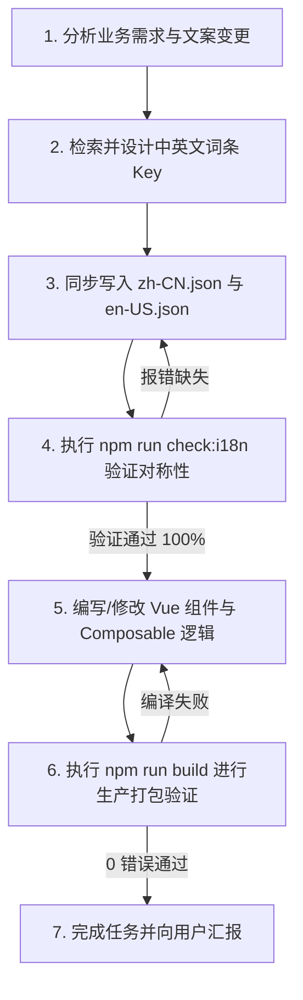

# AGENT.md - AI Coding Agent 研发与维护规范

> **目标受众**：面向所有参与本子项目（`webrtc-operator/web-app`）维护的 AI Agent（包括 Antigravity, Claude, Codex, Cursor 等）以及全栈开发工程师。
> **核心定位**：本目录为云手机全平台 Web 控制台前端项目（基于 Vue 3 + Pinia + WebRTC / WebSocket + xterm.js）。
> **生效范围**：任何涉及本目录内代码的新增、修改、重构或排障任务，**必须无条件严格遵守本规范**。

---

## 🛡️ 一、 绝不可逾越的核心红线 (CRITICAL GUARDRAILS)

### 🔴 规则 1：严禁在 Vue 模板与脚本中硬编码中文字符串 (Zero Hardcoded Chinese)
本项目已实现 100% 深度中英文双语国际化体系。
- ❌ **严禁行为**：
  - 严禁在 `.vue` 模板中的标签内容、按钮文字、属性（如 `placeholder`、`title`、`alt`）直接写中文；
  - 严禁在 `<script setup>` 或 `.js` 逻辑中的 `alert()`、`confirm()`、Toast 提示、错误处理（`catch (err)`）、时间格式化输出中直接写死中文；
  - 严禁在控制台与终端输出流（如 `term.writeln`、`deployStatus`）中直接拼接裸露的中文 ANSI 字符串。
- ✅ **唯一正确做法**：
  - 模板中统一使用 `$t('namespace.key')`；
  - 组合式 API 中使用 `const { t } = useI18n()` 或在非组件模块中引入全局 `i18n` 实例（`import i18n from '@/locales'`）调用 `i18n.global.t(...)`。

---

### 🔴 规则 2：双语词典必须 100% 结构对称更新 (Mandatory 100% Symmetrical)
- 语言字典文件位于：
  - 中文主词典：[`src/locales/zh-CN.json`](./src/locales/zh-CN.json)
  - 英文主词典：[`src/locales/en-US.json`](./src/locales/en-US.json)
- ❌ **严禁行为**：
  - 严禁“只加中文、遗漏英文”；
  - 严禁中英文两边的键名（Key）层级、拼写或命名空间不对称。
- 🔒 **同步规范**：
  - 凡是新增业务词条，**必须同时**在 `zh-CN.json` 和 `en-US.json` 相同命名空间下添加对应高质量翻译；
  - 词条命名采用小驼峰（camelCase），模块命名空间保持清晰聚合（如 `common`, `nav`, `topBar`, `login`, `deviceCard`, `deviceClient`, `console`, `settings`, `dashboard`, `files`, `users`, `deploy`, `license`, `share`, `devicesAdmin`, `keymap`, `tags`, `multi`, `advanced`, `audit`, `batchText`, `quickTexts` 等）。

---

### 🔴 规则 3：改动后必须运行多语言自动化校验 (Build & Check Gate)
- 项目内置了多语言对称性自动化检测脚本：
  ```bash
  npm run check:i18n
  ```
- 🔒 **强制门禁**：
  - 每次代码修改完毕，**必须执行 `npm run check:i18n` 并确保返回 `100% Symmetrical!`**；
  - `npm run build` 与 `npm run build:demo` 均已在前置流水线中强绑定 `check:i18n`，任何词条单侧缺失均会导致打包直接中断报错。Agent 不得绕过或移除此检查！

---

### 🔴 规则 4：长英文 UI 弹性防挤压排版保护 (Layout Robustness)
英文词组通常比中文长 2~3 倍（例如：`设备管理` vs `Device Management`，`批量文本下发` vs `Batch Text Broadcast`）。
- ❌ **严禁行为**：
  - 严禁给包含国际化文本的按键、标签、表头设置窄固定宽度（如 `width: 80px`），否则英文下必然发生文字溢出截断或换行把右侧控键挤出视口。
- ✅ **排版规范**：
  - 工具栏、操作栏按键采用 `flex-shrink: 0`、弹性宽度或设定合理的 `min-width`；
  - 设备卡片与列表关键标识采用 `overflow: hidden; text-overflow: ellipsis; white-space: nowrap;` 并务必配置 `:title` 悬浮提示完整全称；
  - 复杂操作栏容器应支持 `flex-wrap: wrap` 或自适应滚动，杜绝破坏直控画面与视口。

---

### 🔴 规则 5：严禁直接修改外部开源镜像仓库 `ScrcpyOverWebRTC/`
- 项目根目录下的 `ScrcpyOverWebRTC/` 为 GitHub 独立同步 submodule；
- ❌ **严禁行为**：严禁在 `ScrcpyOverWebRTC/` 目录下做任何手动代码修改或提交；
- ✅ **唯一修改源**：前端代码的所有开发与重构，必须且只能在本项目当前目录（`webrtc-operator/web-app/`）中进行。

---

## 🛠️ 二、 AI Agent 标准操作流程 (Standard Operating Procedure)

当接到关于本前端项目（`web-app`）的开发、修改或缺陷排查需求时，AI Agent 必须严格按照以下步骤推进：



### 步骤清单：
1. **文案提取先行**：梳理新功能涉及的所有静态与动态提示词，在 `zh-CN.json` 和 `en-US.json` 确定归属命名空间。
2. **双语对称录入**：确保中英文词典结构、变量占位符（如 `{name}`, `{count}`）100% 一致。
3. **即时自动化核验**：
   ```bash
   node scripts/check-i18n.js
   ```
4. **组件代码落地**：模板中使用 `$t(...)`，脚本逻辑中使用 `t(...)`。
5. **编译与样式验证**：
   ```bash
   npm run build
   ```
   确保 0 error，且所有 32 个静态产物正常输出。
